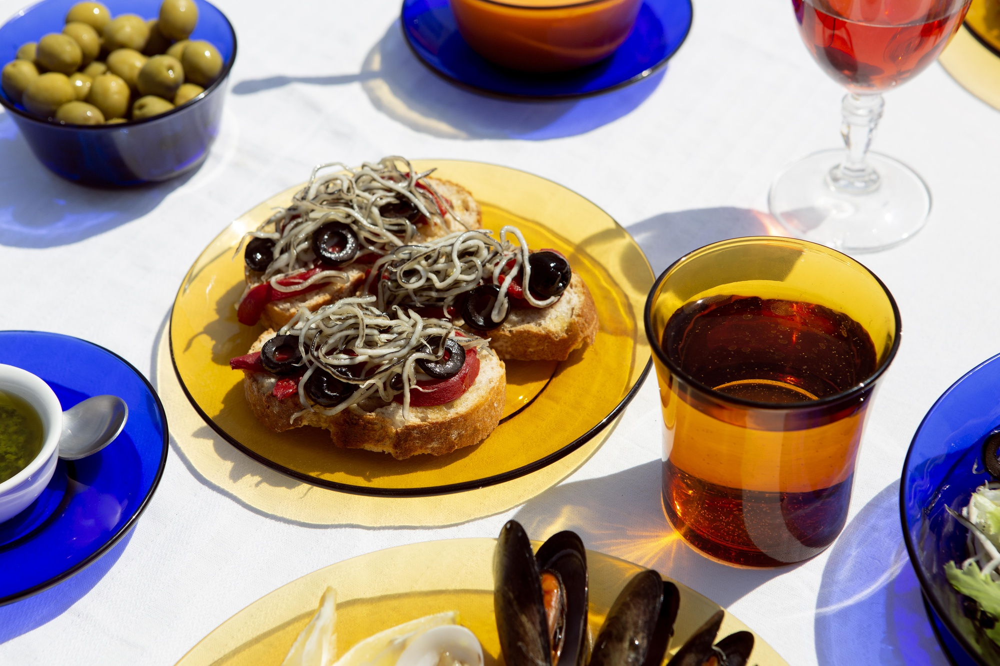
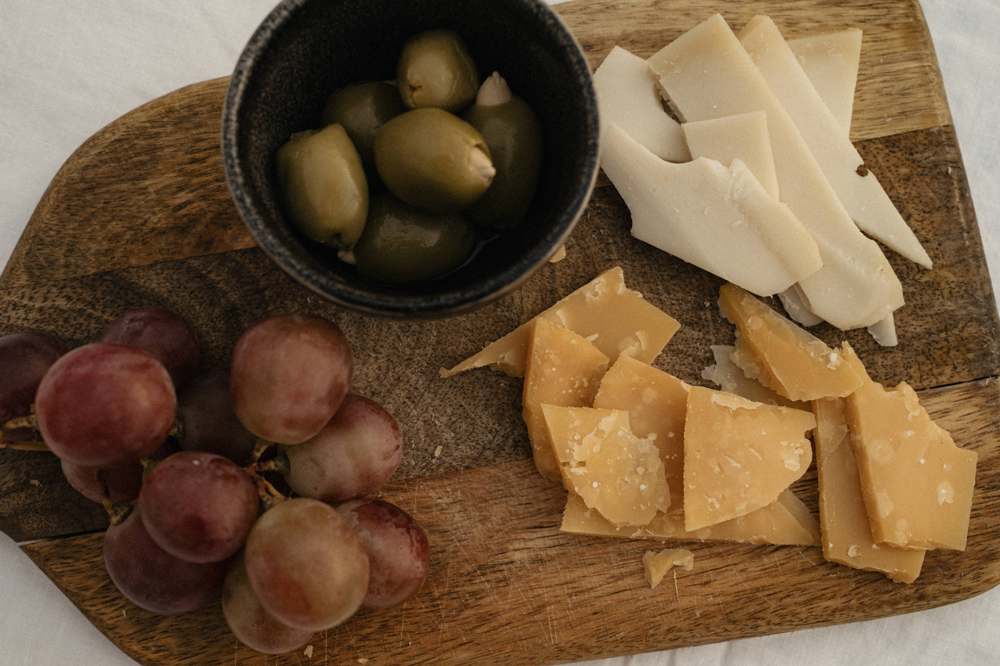

# Memoria
En cuánto a la organización del proyecto y sus partes, para ordenarlo y escribirlo de manera estructurada y adecuada he optado por utilizar la metodología Bem, ya que se ajusta a la distribución de bloques que quería mantener en el trabajo. 
Es de gran utilidad a la hora de realizar proyectos con una estructura detallada y clara que distinga entre bloques y elementos porque organiza el código en bloques reutilizables.

Esta metodología se basa en tres conceptos principales: el bloque (es el componente principal), los elementos (son las partes que componen el bloque) y los modificadores (son variaciones del bloque o elemento).

Hablando sobre estructurar y organizar mi proyecto, he utilizado las etiquetas `<header>`, `<main>` y `<footer>` en los archivos HTML porque son partes esenciales para organizar el contenido de la web en secciones diferenciadas. El `<header>` contiene la información del encabezado, el `<main>` incluye el contenido principal de la página y por último el `<footer>` acoge información complementaria como los derechos de autor, datos legales y el sistema de cookies. 

Además de estas etiquetas, he empleado otras que también ayudan a estructurar y organizar el contenido. Por ejemplo, la etiqueta `<section>` sirve para diferenciar correctamente algunas partes de mi código, las etiquetas `<h1>`,`<h2>`,`<h3>`... son aplicadas como encabezados, la etiqueta `<p>`, se utiliza para escribir un párrafo de un texto y añadir espacio antes y después del propio párrafo, con la finalidad de facilitar su lectura y comprensión.  
Sumado a esto, otra etiqueta clave es `<a href=""></a>` ya que crea enlaces para que las personas navegen por la web de manera fácil. Además, para definir listas ordenadas o desordenadas las etiquetas `<ol>` y `<ul>` resultan ser muy útiles porque las ordenadas se crean con números o letras y las no ordenadas con símbolos (normalmente puntos).


hola, estoy haciendo  un trabajo muy importante pero hay cosas que no se hacer, necesito que escribas el codigo como si fueras una persona que no tiene mucha experiencia en diseñar webs pero haciendo bien las cosas y de manera estructurada


<script>
    function toggleMenu() {
        const nav = document.querySelector('.nav');
        nav.classList.toggle('nav--activo');
    }
</script>


<i class="fa fa-thumbs-up" aria-hidden="true"></i>
<i class="fa fa-thumbs-down" aria-hidden="true"></i>
<i class="fa fa-external-link-square" aria-hidden="true"></i>


#faeae1
#5e3023
#bf8551
#000000

img {
    transform: rotate(90deg);
    /* Asegúrate de ajustar el tamaño también si es necesario */
    width: auto;
    height: 100%;
}


PODRIA SER PARA UN SLIDER DE RESEÑAS
<section class="slider">
                    <div class="slider__container container">
                    

                    <section class="slider__imagenes slider__imagenes--ver" data-id="1">
                        <figure class="slider__imgs">
                            
                        </figure>
                    </section>

                    <section class="slider__imagenes" data-id="2">
                        <figure class="slider__imgs">
                            
                        </figure>
                    </section>

                    <section class="slider__imagenes" data-id="3">
                        <figure class="slider__imgs">
                            
                        </figure>
                    </section>

                    <section class="slider__imagenes" data-id="4">
                        <figure class="slider__imgs">
                            
                        </figure>
                    </section>

                    <section class="slider__imagenes" data-id="5">
                        <figure class="slider__imgs">
                            
                        </figure>
                    </section>

                    <section class="slider__imagenes" data-id="6">
                        <figure class="slider__imgs">
                            
                        </figure>
                    </section>
                    
                    </div>


<!-- Confirmar Contraseña -->
<label for="pass2">Confirmar Contraseña</label>
                            <input type="password" name="pass" id="pass2" required>
        
<!-- Edad -->
<label for="edad">Edad</label>
<input type="number" name="edad" id="edad" required>
        
<!-- Género -->
<div>
    <input type="radio" name="gender" value="male"> Hombre
    <input type="radio" name="gender" value="female"> Mujer
 </div>


<!-- Subir archivo -->
                            <label for="archivo">Subir foto</label>
                            <input type="file" name="archivo" id="archivo" placeholder="Sube tu receta!!" accept=".jpg,.jpeg,.png,.pdf">


                    
                    
</section>

```css
.container  {
        width: 90%;
        max-width: 100%;
        margin-top: 10px;
        overflow: hidden;
    }

    .slider {
        padding: 40px 0; /* 40px arriba y abajo, y 0 hacia los lados*/
    }

    .slider__container {
        display: grid;
        grid-template-columns: 50px 1fr 50px; /* quiero tener 3 columnas, para poner la flecha a un lado, el contenido en medio y la otra flecha al otro lado*/
        display: flex;
        justify-content: center;
        align-items: center;
        gap: 10px;
        overflow: hidden;
    }

    .slider__imagenes {
        grid-column: 2/3; /* todas las imgs con .slider__imagenes empiezan en la columna 2 y acaben en la 3*/
        grid-row: 1/2; /*como solo hay una linea, las imgs empiezan en la 1 y acaban en la 2*/
        opacity: 0; /* para que no se vean las imagenes, pq quiero que se vea primero la 1*/
        transition: opacity 1s ease;
    }

    .slider__imagenes--ver {
        opacity: 1;
    }

    .slider__imgs {
        max-width: 300px;
    }

    .slider__img {
        width: 300px;
        height: 200px;
        border-radius: 7px;
        object-fit: cover;
        display: block;
        margin: 0 auto;
    }

    .slider__arrow {
        cursor: pointer;
        width: 50px;
        height: 50px;
    }
```


````js
// // -------------------------------------------------------------------
// // 1. Declaramos constantes y variables
// // -------------------------------------------------------------------

// // Selecciono el contenedor de imágenes del carrusel del HTML y también las propias imagenes
// const sliderImages = document.querySelector('.carrousel__imagenes'); 
// const images = document.querySelectorAll('.carrousel__img');
// // Selecciono los botones con ids 
// const btnNext = document.querySelector('#btnSig');
// const btnPrev = document.querySelector('#btnAnt'); 

// // variable para saber que imagen se muestra 
// let currentImageIndex = 0; // para empezar en la imagen 1
// const totalImages = images.length; // es el total de todas las imagenes


// // -------------------------------------------------------------------
// // 2. Events y funciones
// // -------------------------------------------------------------------

// // eventListener btn "Siguiente"
// btnNext.addEventListener('click', nextImage);

// // eventListener btn "Anterior"
// btnPrev.addEventListener('click', prevImage);

// // para pasar de la imagen 1 a la siguiente
// function nextImage() {
//     currentImageIndex++; // + indice
//     if (currentImageIndex >= totalImages) {
//         currentImageIndex = 0; // si llega a la imagen 6, vuelve a la 1
//     }
//     actualizarSlider();
// }

// // para ir a la imagen anterior
// function prevImage() {
//     currentImageIndex--; // - indice
//     if (currentImageIndex < 0) {
//         currentImageIndex = totalImages - 1; // Si está en la primera, vuelve a la última
//     }
//     actualizarSlider();
// }

// // para actualizar donde está (la posición) del slider
// function actualizarSlider() {
//     const movimiento = currentImageIndex * -100; 
//     sliderImages.style.transform = `translateX(${movimiento}%)`;
// }

// // -------------------------------------------------------------------
// // 3. Inicializamos el slider
// // -------------------------------------------------------------------
// actualizarSlider();
